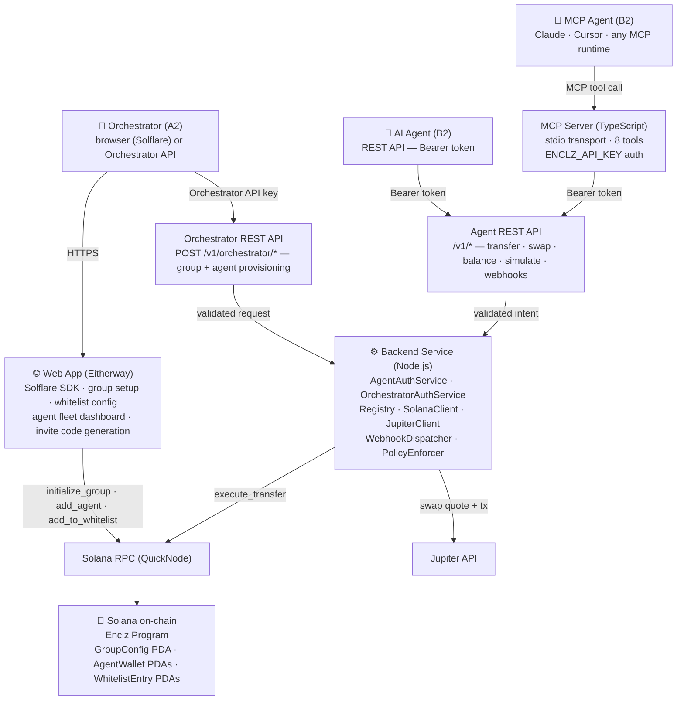

# Enclz — Technical Specification (Agent Wallet Edition)

## Tech Stack

| Layer | Technology |
|---|---|
| Smart contract | Rust · Pinocchio |
| Blockchain | Solana (devnet → mainnet-beta) |
| On-chain security | Program-owned PDAs · whitelist PDAs · per-wallet operator nonce |
| Backend | Node.js · JavaScript |
| Web app | Eitherway (AI app builder · deployed on Eitherway platform) |
| Wallet (Orchestrator) | Solflare SDK (`@solflare-wallet/sdk`) |
| REST API (agents + orchestrator) | Express.js · Bearer token auth · webhook callbacks |
| MCP Server | TypeScript · `@modelcontextprotocol/sdk` · stdio transport |
| DEX aggregator | Jupiter API v6 |
| RPC provider | QuickNode |
| Testing | Vitest |

---

## System Overview



---

## Smart Contract (Pinocchio / Rust)

### Accounts

#### `GroupConfig` PDA
Seed: `["group", owner_pubkey]`

```
owner:                Pubkey    // Orchestrator's Solana wallet (policy admin)
backend_operator:     Pubkey    // backend's signing keypair (authorized caller)
protocol_fee_wallet:  Pubkey    // Enclz protocol ATA receives fees
agent_count:          u8
```

#### `AgentWallet` PDA
Seed: `["wallet", group_pubkey, agent_index as u8]`

```
group:               Pubkey
display_name:        [u8; 32]  // human label for fleet dashboard ("research-bot-1")
daily_limit:         u64       // USDC 6-decimal units
per_tx_limit:        u64
hourly_tx_cap:       u8
spent_today:         u64       // resets at UTC midnight
tx_count_this_hour:  u8        // resets on the hour
last_spend_reset:    i64
last_hour_reset:     i64
operator_nonce:      u64       // incremented per execute_transfer — replay protection
```

**Default limits at initialization:**
- `daily_limit`: 10 USDC (10_000_000)
- `per_tx_limit`: 1 USDC (1_000_000)
- `hourly_tx_cap`: 5

Token accounts (ATAs) are owned by the `AgentWallet` PDA and created at agent initialization.

#### `WhitelistEntry` PDA
Seed: `["whitelist", group_pubkey, target_address]`

```
label:            [u8; 32]  // "Helius RPC service", "Kamino USDC vault"
added_by:         Pubkey    // audit trail
entry_type:       u8        // 0 = intra-group agent (permanent), 1 = external recipient (TTL + amount-capped), 2 = protocol address (permanent)
ttl_expires_at:   i64       // Unix timestamp; 0 = no expiry (used for entry_type 0 and 2)
approved_amount:  u64       // USDC 6-decimal; 0 = unlimited (used for entry_type 0 and 2)
amount_used:      u64       // cumulative amount transferred to this address; incremented on every execute_transfer
```

Existence = whitelisted. Close account = removed.

`entry_type = 0` (intra-group): auto-added when an agent is created (`add_agent`). `ttl_expires_at = 0`, `approved_amount = 0`. Permanent.

`entry_type = 1` (external recipient): TTL and approved_amount set by orchestrator. On `amount_used >= approved_amount`, the account is closed automatically by `execute_transfer` (auto-void). Expired entries (`now > ttl_expires_at`) are rejected and must be closed + re-created by the orchestrator.

`entry_type = 2` (protocol): enables deposit/withdraw. `ttl_expires_at = 0`, `approved_amount = 0`. Permanent. The DEX swap router is whitelisted as `entry_type = 2` at group initialization.

### Instructions

#### `initialize_group`
Creates `GroupConfig` PDA. Owner signs.

```
Accounts:
  owner               [signer, writable]
  group_config        [writable, init]  PDA
  system_program

Args:
  backend_operator:     Pubkey
  protocol_fee_wallet:  Pubkey   // Enclz's fee collection wallet
```

#### `add_agent`
Creates an `AgentWallet` PDA + its ATAs. Auto-adds agent's PDA to group whitelist as `entry_type = 0` (intra-group, permanent, unlimited).

```
Accounts:
  owner          [signer, writable]
  group_config   [writable]
  agent_wallet   [writable, init]  PDA
  system_program

Args:
  display_name:   [u8; 32]
  daily_limit:    Option<u64>   // overrides default if provided
  per_tx_limit:   Option<u64>
  hourly_tx_cap:  Option<u8>
```

#### `execute_transfer`
Called by the backend operator for every transfer and swap. Validates nonce, whitelist, and limits, then executes the SPL token transfer. Deducts protocol fee at execution time.

```
Accounts:
  backend_operator       [signer]
  group_config           []
  agent_wallet           [writable]   // limits + nonce updated here
  from_token_account     [writable]   // agent vault ATA
  to_token_account       [writable]   // recipient ATA (must exist)
  whitelist_entry        []           // PDA must exist for recipient address
  protocol_fee_token_acct [writable]  // Enclz protocol ATA
  token_program          []
  system_program

Args:
  amount:          u64
  expected_nonce:  u64   // must match agent_wallet.operator_nonce
```

Enforcement (in order):
1. Verify `expected_nonce == agent_wallet.operator_nonce` → reject if mismatch
2. Increment `operator_nonce`
3. Reset `spent_today` / `tx_count_this_hour` if timestamps have rolled over
4. Reject if `amount > per_tx_limit`
5. Reject if `spent_today + amount > daily_limit`
6. Reject if `tx_count_this_hour >= hourly_tx_cap`
7. Verify `whitelist_entry` PDA exists for recipient address → reject `whitelist_violation` if missing
8. If `whitelist_entry.entry_type == 1` (external recipient):
   a. Reject if `now > whitelist_entry.ttl_expires_at` → `whitelist_expired`
   b. Reject if `whitelist_entry.amount_used + amount > whitelist_entry.approved_amount` → `whitelist_amount_exhausted`
9. Compute protocol fee:
   - `protocol_fee = amount * 10 / 10_000`  (10 bps = 0.1%)
   - `net_amount = amount - protocol_fee`
10. Execute SPL token transfer: `net_amount` to recipient, `protocol_fee` to `protocol_fee_wallet`
11. Increment `spent_today` (by `amount`, not `net_amount` — fee counts against limit) and `tx_count_this_hour`
12. If `whitelist_entry.entry_type == 1`: increment `whitelist_entry.amount_used` by `amount`
    - If `whitelist_entry.amount_used >= whitelist_entry.approved_amount`: close `whitelist_entry` PDA (auto-void, rent returned to owner)

#### `add_to_whitelist`
Owner-only. Creates a `WhitelistEntry` PDA.

```
Accounts:
  owner            [signer, writable]
  group_config     []
  whitelist_entry  [writable, init]  PDA
  system_program

Args:
  target_address:  Pubkey
  label:           [u8; 32]
  entry_type:      u8    // 0 = intra-group (auto, permanent), 1 = external recipient (TTL + capped), 2 = protocol (permanent)
  ttl_expires_at:  i64   // required for entry_type 1; 0 for entry_type 0 and 2
  approved_amount: u64   // required for entry_type 1 (USDC 6-decimal); 0 for entry_type 0 and 2
```

#### `renew_whitelist_entry`
Owner-only. Updates `ttl_expires_at` and/or `approved_amount` for an existing `entry_type = 1` entry. Cannot be used on intra-group or protocol entries.

```
Accounts:
  owner            [signer]
  group_config     []
  whitelist_entry  [writable]

Args:
  ttl_expires_at:  i64   // new expiry; must be > now
  approved_amount: u64   // new cap; must be >= current amount_used
```

This is the primary DAU driver: orchestrators return to renew approvals before they expire or top up the amount cap when it runs low.

#### `remove_from_whitelist`
Owner-only. Closes the `WhitelistEntry` PDA, reclaiming rent.

#### `update_agent_limits`
Owner-only. Adjusts spend limits for a specific agent.

```
Args:
  daily_limit:    Option<u64>
  per_tx_limit:   Option<u64>
  hourly_tx_cap:  Option<u8>
```

#### `emergency_withdraw`
Owner-only. Bypasses daily limits, sweeps all agent vault tokens to a destination address.

#### `update_backend_operator`
Owner-only. Rotates the authorized backend keypair.

---

## Backend Service (Node.js)

### Module Structure

```
src/
  index.js                   // entry point, wires up HTTP server
  api/
    router.js                // mounts /v1/orchestrator/* and /v1/* agent endpoints
    auth/
      agent.js               // Bearer token middleware — validates API key, resolves agent
      orchestrator.js        // Orchestrator API key middleware — resolves group owner
    routes/
      orchestrator/
        groups.js            // POST /v1/orchestrator/groups
        agents.js            // POST /v1/orchestrator/groups/:id/agents
        whitelist.js         // POST/PATCH/DELETE /v1/orchestrator/groups/:id/whitelist[/:address]
        limits.js            // PATCH /v1/orchestrator/groups/:id/agents/:aid/limits
        revoke.js            // POST /v1/orchestrator/agents/:aid/revoke
      agent/
        register.js          // POST /v1/register
        transfer.js          // POST /v1/transfer
        swap.js              // POST /v1/swap
        deposit.js           // POST /v1/deposit
        withdraw.js          // POST /v1/withdraw
        simulate.js          // POST /v1/intents/simulate
        balance.js           // GET  /v1/balance
        limits.js            // GET  /v1/limits
        history.js           // GET  /v1/history
        webhooks.js          // POST /v1/webhooks
  registry/
    index.js                 // CRUD for agent registry, credentials, invitations, webhooks
    schema.js                // data model definitions
  policy/
    enforcer.js              // pre-flight limit checks mirroring on-chain logic
    templates.js             // policy template definitions
  clients/
    solana.js                // @solana/web3.js wrapper (QuickNode RPC)
    jupiter.js               // Jupiter Quote + Swap API wrapper
    lending.js               // generic lending adapter (Kamino etc.)
  webhooks/
    dispatcher.js            // fires HMAC-signed events to registered callback URLs
    events.js                // event type definitions and payload builders
  monitor/
    index.js                 // subscribes to agent wallet ATAs; dispatches incoming payment alerts

mcp/                         // MCP server — separate package, client of Agent REST API
  index.ts                   // entry point — creates MCP server, registers tools, starts stdio transport
  tools.ts                   // tool definitions: input schemas + handler functions
  client.ts                  // thin HTTP client wrapping Agent REST API (uses ENCLZ_API_URL + ENCLZ_API_KEY)
  package.json               // { "name": "@enclz/mcp-server", "bin": { "enclz-mcp": "./dist/index.js" } }
```

### Registry Data Model

```js
// groups table
{
  id:                   string,   // uuid
  group_config_pda:     string,   // GroupConfig PDA pubkey (base58)
  owner_pubkey:         string,   // orchestrator's Solana wallet
  orchestrator_key_hash: string,  // bcrypt hash of orchestrator API key
  created_at:           Date,
}

// agents table
{
  id:                  string,   // uuid
  group_id:            string,   // FK → groups.id
  agent_wallet_pda:    string,   // AgentWallet PDA pubkey (base58)
  display_name:        string,
  operator_nonce:      number,   // mirror of on-chain nonce for pre-flight checks
  created_at:          Date,
}

// agent_credentials table
{
  id:            string,   // uuid
  agent_id:      string,   // FK → agents.id
  api_key_hash:  string,   // bcrypt hash — plaintext never stored
  revoked:       boolean,
  created_at:    Date,
  revoked_at:    Date | null,
}

// agent_invitations table
{
  id:          string,   // uuid
  agent_id:    string,   // FK → agents.id (pre-created, unactivated)
  code_hash:   string,   // hash of invitation code — plaintext never stored
  used:        boolean,
  expires_at:  Date,     // 24 hours from creation
  created_at:  Date,
}

// agent_webhooks table
{
  id:           string,   // uuid
  agent_id:     string,   // FK → agents.id — null for fleet-level orchestrator webhook
  group_id:     string,   // FK → groups.id — set for fleet-level webhooks
  url:          string,   // HTTPS callback URL
  secret:       string,   // HMAC signing secret for payload verification
  event_types:  string[], // e.g. ["transfer.confirmed","policy.limit_threshold"]
  active:       boolean,
  created_at:   Date,
}

// whitelist_entries table  (mirrors on-chain WhitelistEntry PDAs; source of truth is on-chain)
{
  id:               string,   // uuid
  group_id:         string,   // FK → groups.id
  address:          string,   // base58 Solana address
  label:            string,
  entry_type:       number,   // 0 = intra-group, 1 = external, 2 = protocol
  ttl_expires_at:   Date | null,
  approved_amount:  number | null,  // USDC
  amount_used:      number,         // updated after every successful transfer
  voided:           boolean,        // true when amount_used >= approved_amount (entry closed on-chain)
  created_at:       Date,
}

// idempotency_cache table
{
  key:        string,   // idempotency_key from request
  agent_id:   string,   // FK → agents.id
  response:   json,     // cached response body
  created_at: Date,     // expire after 24h
}
```

### Policy Enforcer

Pre-flight checks mirror on-chain logic. Runs before every transfer/swap submission to avoid wasting compute fees on transactions that will fail on-chain.

```js
// policy/enforcer.js
function preflightCheck(agent, amount) {
  // load current state from registry (mirrors on-chain)
  if (amount > agent.per_tx_limit) throw PolicyError('per_tx_limit_exceeded');
  if (agent.spent_today + amount > agent.daily_limit) throw PolicyError('daily_limit_exceeded');
  if (agent.tx_count_this_hour >= agent.hourly_tx_cap) throw PolicyError('hourly_cap_exceeded');
  if (!isWhitelisted(group, recipient)) throw PolicyError('whitelist_violation');
}
```

The on-chain program is the authoritative enforcer — pre-flight only reduces latency and avoids failed transactions.

### Policy Templates

```js
// policy/templates.js
const TEMPLATES = {
  'research-agent': {
    per_tx_limit: 0.10,     // USDC
    daily_limit:  1.00,
    hourly_tx_cap: 10,
  },
  'micro-payment-agent': {
    per_tx_limit: 1.00,
    daily_limit:  10.00,
    hourly_tx_cap: 5,
  },
  'payment-agent': {
    per_tx_limit: 10.00,
    daily_limit:  100.00,
    hourly_tx_cap: 20,
  },
};
```

### Transaction Execution Pipeline

For every agent intent (transfer / swap / deposit / withdraw):

```
authenticate(api_key)
  → resolve agent from registry
  → reject if revoked

check idempotency_key
  → if cached: return cached response

preflightCheck(agent, amount, recipient)
  → PolicyError → 403 with structured error code

if transfer:
  validate recipient is base58
  build_transfer_tx(agent_wallet, to_address, amount, token)

if swap:
  fetch_jupiter_quote(from_token, to_token, amount)
  build_swap_tx(quote)

if deposit:
  resolve_lending_protocol(protocol?)
  build_deposit_tx(lending_client, agent_wallet, token, amount)

if withdraw:
  resolve_lending_protocol(protocol?)
  build_withdraw_tx(lending_client, agent_wallet, token, amount)

sign_tx(operator_keypair, tx)

submit_tx(signed_tx)
  → Solana RPC sendTransaction

cache_idempotency_response(key, response)

dispatch_webhook(agent, 'transfer.confirmed', { tx_sig, amount, to, memo, task_id })

check_anomaly_thresholds(agent, whitelist_entry)
  → if spent_today >= 0.8 * daily_limit: dispatch_fleet_webhook('policy.limit_threshold')
  → if whitelist_entry.entry_type == 1 AND whitelist_entry.amount_used >= 0.8 * whitelist_entry.approved_amount:
      dispatch_fleet_webhook('policy.whitelist_amount_threshold')
  → if whitelist_entry.entry_type == 1 AND whitelist_entry.amount_used >= whitelist_entry.approved_amount:
      dispatch_fleet_webhook('policy.whitelist_voided')
```

### Wallet Monitor

On backend startup, subscribes to every registered agent wallet ATA via QuickNode websocket (`connection.onAccountChange`). On balance increase, dispatches `payment.received` webhook to the agent's registered webhook URL.

```
onAccountChange(ata_pubkey)
  → fetch new balance
  → if balance > last_known_balance:
      resolve agent from registry
      dispatch_webhook(agent, 'payment.received', { amount, from: null })
      update last_known_balance
```

---

## REST API

### Agent Authentication

All `/v1/*` endpoints (except `/v1/register`) require:
```
Authorization: Bearer <api_key>
```

Scoped API key issued at registration. Never stored in plaintext. Resolves to `agent_id`. Revoked credentials return `401`.

### Orchestrator Authentication

All `/v1/orchestrator/*` endpoints require:
```
Authorization: Bearer <orchestrator_api_key>
```

Separate credential tier issued at group creation. Resolves to `group_id` + owner identity.

---

### Orchestrator Endpoints

#### `POST /v1/orchestrator/groups`

Create a new group on-chain and in the registry. Backend signs the `initialize_group` instruction using the configured operator keypair; the orchestrator's Solana pubkey is recorded as owner.

```js
// Request
{
  "owner_pubkey":  "string",   // orchestrator's Solana wallet (base58)
  "group_name":    "string"
}

// Response 200
{
  "group_id":            "string",
  "group_config_pda":    "string",
  "orchestrator_api_key": "string"   // shown once — store immediately
}
```

#### `POST /v1/orchestrator/groups/:group_id/agents`

Add an agent to a group. Creates `AgentWallet` PDA on-chain and returns a one-time invitation code.

```js
// Request
{
  "display_name":   "string",
  "template":       "string",   // "research-agent" | "micro-payment-agent" | "payment-agent" | "custom"
  "per_tx_limit":   number,     // optional override (USDC)
  "daily_limit":    number,     // optional override
  "hourly_tx_cap":  number      // optional override
}

// Response 200
{
  "agent_id":         "string",
  "agent_wallet_pda": "string",
  "invitation_code":  "string"   // one-time, expires 24h, shown once
}
```

#### `PATCH /v1/orchestrator/groups/:group_id/agents/:agent_id/limits`

Update spend limits for an existing agent.

```js
// Request
{
  "per_tx_limit":  number,   // optional
  "daily_limit":   number,   // optional
  "hourly_tx_cap": number    // optional
}

// Response 200
{ "agent_id": "string", "updated": true }
```

#### `POST /v1/orchestrator/groups/:group_id/whitelist`

Add an address to the group whitelist.

```js
// Request
{
  "address":          "string",               // base58 Solana address
  "label":            "string",
  "entry_type":       "external" | "protocol", // "external" = TTL + amount-capped; "protocol" = permanent
  "ttl_seconds":      number,                 // required for entry_type "external" (e.g. 2592000 = 30 days)
  "approved_amount":  number                  // required for entry_type "external" (USDC; e.g. 50.00)
}

// Response 200
{
  "whitelist_entry_pda": "string",
  "ttl_expires_at":      number,   // Unix timestamp; null for protocol entries
  "approved_amount":     number    // null for protocol entries
}
```

#### `PATCH /v1/orchestrator/groups/:group_id/whitelist/:address`

Renew TTL or top up approved amount for an existing external whitelist entry. Cannot be called on intra-group or protocol entries.

```js
// Request (all fields optional; at least one required)
{
  "ttl_seconds":      number,   // new TTL from now (e.g. 2592000 = another 30 days)
  "approved_amount":  number    // new total cap; must be >= current amount_used
}

// Response 200
{
  "address":          "string",
  "ttl_expires_at":   number,
  "approved_amount":  number,
  "amount_used":      number,
  "amount_remaining": number
}
```

#### `DELETE /v1/orchestrator/groups/:group_id/whitelist/:address`

Remove address from whitelist. Closes the on-chain PDA. Cannot remove intra-group entries. Returns `204`.

#### `POST /v1/orchestrator/agents/:agent_id/revoke`

Revoke agent's API key immediately.

```js
// Response 200
{ "agent_id": "string", "revoked": true }
```

After revocation, orchestrator calls `POST /v1/orchestrator/groups/:id/agents` again to issue a new invitation code.

#### `POST /v1/orchestrator/webhooks`

Register a fleet-level webhook for policy events across all agents in a group.

```js
// Request
{
  "group_id":    "string",
  "url":         "string",   // must be HTTPS
  "event_types": ["string"]  // ["policy.limit_threshold","policy.limit_exceeded_attempt","policy.whitelist_violation"]
}

// Response 200
{ "webhook_id": "string", "signing_secret": "string" }  // signing_secret shown once
```

---

### Agent Endpoints

#### `POST /v1/register`

Exchange one-time invitation code for an API key. Code invalidated immediately after use.

```js
// Request
{ "invitation_code": "string" }

// Response 200
{ "agent_id": "string", "api_key": "string" }   // api_key shown once

// Response 400
{ "error": "invalid_invitation_code", "message": "Code expired, already used, or not found." }
```

#### `POST /v1/transfer`

Transfer tokens to a whitelisted address.

```js
// Request
{
  "to":               "string",   // base58 Solana address — must be whitelisted
  "amount":           number,     // token units (e.g. 2.50 for 2.50 USDC)
  "token":            "string",   // "USDC" | "SOL" | "PUSD"
  "memo":             "string",   // optional — stored with transaction
  "task_id":          "string",   // optional — orchestrator-defined task reference
  "idempotency_key":  "string"    // optional; same key = same response, no re-execution
}

// Response 200
{
  "tx_sig":               "string",
  "status":               "confirmed",
  "net_amount":           number,   // after protocol fee
  "protocol_fee":         number,
  "daily_remaining":      number,
  "hourly_tx_remaining":  number
}

// Response 403
{
  "error":   "whitelist_violation" | "whitelist_expired" | "whitelist_amount_exhausted" | "daily_limit_exceeded" | "per_tx_limit_exceeded" | "hourly_cap_exceeded",
  "message": "string"
}

// Response 503 (transient RPC or submission failure)
{
  "error":       "submission_failed",
  "message":     "string",
  "retry_after": number   // seconds; agent retries with same idempotency_key
}
```

#### `POST /v1/swap`

Swap tokens via the whitelisted Jupiter router. Swap router is whitelisted at group initialization.

```js
// Request
{
  "from_token":       "string",
  "to_token":         "string",
  "amount":           number,
  "task_id":          "string",    // optional
  "idempotency_key":  "string"     // optional
}

// Response 200
{
  "tx_sig":              "string",
  "status":              "confirmed",
  "received_amount":     number,
  "rate":                number,
  "daily_remaining":     number,
  "hourly_tx_remaining": number
}
```

#### `POST /v1/deposit`

Deposit tokens into a whitelisted lending protocol.

```js
// Request
{
  "token":            "string",
  "amount":           number,
  "protocol":         "string",   // optional label — uses first available if omitted
  "task_id":          "string",
  "idempotency_key":  "string"
}

// Response 200
{
  "tx_sig":           "string",
  "status":           "confirmed",
  "protocol":         "string",
  "deposited_amount": number,
  "current_apy":      number
}

// Response 403
{ "error": "no_whitelisted_protocol" | "daily_limit_exceeded" | "per_tx_limit_exceeded" | "hourly_cap_exceeded" }
```

#### `POST /v1/withdraw`

Withdraw tokens from a whitelisted lending protocol.

```js
// Request
{
  "token":            "string",
  "amount":           number,
  "protocol":         "string",   // optional
  "task_id":          "string",
  "idempotency_key":  "string"
}

// Response 200
{
  "tx_sig":          "string",
  "status":          "confirmed",
  "protocol":        "string",
  "received_amount": number,
  "yield_earned":    number
}

// Response 403
{ "error": "no_whitelisted_protocol" | "insufficient_deposit_balance" }
```

#### `POST /v1/intents/simulate`

Dry-run check: would this transfer/swap succeed? No transaction submitted, no state changed.

```js
// Request — same body shape as /v1/transfer or /v1/swap
{
  "action":  "transfer" | "swap",
  "to":      "string",           // for transfer
  "amount":  number,
  "token":   "string",
  "from_token": "string",        // for swap
  "to_token":   "string"         // for swap
}

// Response 200
{
  "would_succeed":      boolean,
  "reason":             null | "whitelist_violation" | "daily_limit_exceeded" | "per_tx_limit_exceeded" | "hourly_cap_exceeded" | "insufficient_balance",
  "daily_remaining":    number,
  "hourly_tx_remaining": number,
  "estimated_fee":      number    // protocol fee in USDC
}
```

#### `GET /v1/balance`

Current balances and spend headroom.

```js
// Response 200
{
  "balances": { "USDC": number, "SOL": number, "PUSD": number },
  "daily_limit":         number,
  "daily_remaining":     number,
  "per_tx_limit":        number,
  "hourly_tx_cap":       number,
  "hourly_tx_remaining": number
}
```

#### `GET /v1/limits`

Full spend policy and whitelist.

```js
// Response 200
{
  "daily_limit":         number,
  "daily_remaining":     number,
  "per_tx_limit":        number,
  "hourly_tx_cap":       number,
  "hourly_tx_remaining": number,
  "whitelist": [
    {
      "address":          "string",
      "label":            "string",
      "entry_type":       "intra_group" | "external" | "protocol",
      "ttl_expires_at":   number | null,   // Unix timestamp; null for permanent entries
      "approved_amount":  number | null,   // null for permanent entries
      "amount_used":      number | null,   // null for permanent entries
      "amount_remaining": number | null    // null for permanent entries
    }
  ]
}
```

#### `GET /v1/history`

Paginated transaction log for this agent's wallet.

```js
// Query params: ?limit=20&before=<tx_sig>
// Response 200
{
  "transactions": [{
    "tx_sig":       "string",
    "action":       "transfer" | "swap" | "deposit" | "withdraw",
    "amount":       number,
    "net_amount":   number,
    "protocol_fee": number,
    "token":        "string",
    "to":           "string",
    "memo":         "string",
    "task_id":      "string",
    "timestamp":    number
  }]
}
```

#### `POST /v1/webhooks`

Register callback URL for async transaction confirmations and policy events for this agent.

```js
// Request
{
  "url":          "string",    // must be HTTPS
  "event_types":  ["string"]   // ["transfer.confirmed","swap.confirmed","payment.received","policy.limit_threshold"]
}

// Response 200
{ "webhook_id": "string", "signing_secret": "string" }   // signing_secret shown once
```

### Webhook Event Payloads

All webhook requests are signed with `X-Enclz-Signature: sha256=<hmac>`.

```js
// transfer.confirmed
{
  "event":    "transfer.confirmed",
  "agent_id": "string",
  "tx_sig":   "string",
  "amount":   number,
  "net_amount": number,
  "to":       "string",
  "memo":     "string",
  "task_id":  "string",
  "timestamp": number
}

// payment.received
{
  "event":    "payment.received",
  "agent_id": "string",
  "amount":   number,
  "token":    "string",
  "timestamp": number
}

// policy.limit_threshold  (80% of daily limit reached)
{
  "event":           "policy.limit_threshold",
  "agent_id":        "string",
  "daily_limit":     number,
  "daily_spent":     number,
  "daily_remaining": number,
  "timestamp":       number
}

// policy.limit_exceeded_attempt
{
  "event":     "policy.limit_exceeded_attempt",
  "agent_id":  "string",
  "attempted_amount": number,
  "reason":    "daily_limit_exceeded" | "per_tx_limit_exceeded" | "hourly_cap_exceeded",
  "timestamp": number
}

// policy.whitelist_violation
{
  "event":              "policy.whitelist_violation",
  "agent_id":           "string",
  "attempted_recipient": "string",
  "timestamp":          number
}

// policy.whitelist_expiring  (fired once, 24h before TTL expiry)
{
  "event":           "policy.whitelist_expiring",
  "group_id":        "string",
  "address":         "string",
  "label":           "string",
  "ttl_expires_at":  number,
  "amount_remaining": number,
  "timestamp":       number
}

// policy.whitelist_amount_threshold  (fired when 80% of approved_amount consumed)
{
  "event":            "policy.whitelist_amount_threshold",
  "group_id":         "string",
  "agent_id":         "string",
  "address":          "string",
  "label":            "string",
  "approved_amount":  number,
  "amount_used":      number,
  "amount_remaining": number,
  "timestamp":        number
}

// policy.whitelist_voided  (fired when approved_amount fully consumed and entry auto-closed)
{
  "event":           "policy.whitelist_voided",
  "group_id":        "string",
  "agent_id":        "string",
  "address":         "string",
  "label":           "string",
  "approved_amount": number,
  "timestamp":       number
}
```

### Error Format

All error responses follow:
```js
{ "error": "error_code", "message": "human-readable description" }
```

HTTP status codes: `400` bad request, `401` unauthorized, `403` policy violation, `404` not found, `409` conflict (idempotency), `429` rate limit, `500` internal.

**Full error code taxonomy:**

| Code | HTTP | Meaning |
|---|---|---|
| `invalid_invitation_code` | 400 | Code expired, used, or not found |
| `invalid_amount` | 400 | Amount ≤ 0 or non-numeric |
| `invalid_address` | 400 | Not a valid base58 Solana address |
| `unauthorized` | 401 | Missing or invalid API key |
| `revoked_credential` | 401 | API key has been revoked |
| `whitelist_violation` | 403 | Recipient address not in whitelist |
| `whitelist_expired` | 403 | Whitelist entry TTL has expired — orchestrator must re-approve |
| `whitelist_amount_exhausted` | 403 | Whitelist approved amount fully consumed — orchestrator must renew |
| `daily_limit_exceeded` | 403 | Transfer would exceed daily spend ceiling |
| `per_tx_limit_exceeded` | 403 | Transfer exceeds per-transaction limit |
| `hourly_cap_exceeded` | 403 | Hourly transaction count cap reached |
| `no_whitelisted_protocol` | 403 | No eligible lending protocol in whitelist |
| `insufficient_deposit_balance` | 403 | Withdraw amount exceeds protocol deposit |
| `insufficient_balance` | 403 | Agent wallet has insufficient token balance |
| `idempotency_conflict` | 409 | Same idempotency key used with different parameters |
| `submission_failed` | 503 | Transient RPC or network failure; retry with same idempotency key |
| `internal_error` | 500 | Unexpected backend or chain error |

---

## Agent Integration Resources

### `openapi.json`

OpenAPI 3.1 spec covering all agent REST endpoints (`/v1/*`). Generated from route definitions and kept in sync. Consumed by API clients, Postman, and AI code assistants.

Location: `docs2/openapi.json`

### `AGENT_SKILL.md`

Markdown file designed for injection into agent system prompts or context windows. Describes:
- Available operations (transfer, swap, deposit, withdraw, balance, limits, history, simulate)
- Request/response field formats
- Error codes and how to handle them
- Policy constraints (whitelist requirement, limit semantics)
- Idempotency key usage pattern
- When to use simulate before transfer

Compatible with LangChain tool context injection, AutoGen skill description blocks, and plain system-prompt augmentation. No SDK required — agents call the REST API directly using any HTTP client.

Location: `docs2/AGENT_SKILL.md`

### MCP Server

TypeScript package publishing Enclz operations as native MCP tools. Installed once; any MCP-enabled runtime discovers tools automatically.

**Package:** `@enclz/mcp-server`  
**Transport:** stdio (standard MCP)  
**Config:** two env vars — `ENCLZ_API_KEY` (agent API key from registration) and `ENCLZ_API_URL` (default: `https://api.enclz.com`)

**Tools exposed:**

| Tool name | Maps to | Description |
|---|---|---|
| `enclz_transfer` | `POST /v1/transfer` | Transfer tokens to a whitelisted address |
| `enclz_swap` | `POST /v1/swap` | Swap tokens via Jupiter |
| `enclz_deposit` | `POST /v1/deposit` | Deposit into a whitelisted lending protocol |
| `enclz_withdraw` | `POST /v1/withdraw` | Withdraw from a whitelisted lending protocol |
| `enclz_simulate` | `POST /v1/intents/simulate` | Dry-run: would this transfer/swap succeed? |
| `enclz_balance` | `GET /v1/balance` | Token balances and spend headroom |
| `enclz_limits` | `GET /v1/limits` | Full spend policy and whitelist |
| `enclz_history` | `GET /v1/history` | Paginated transaction log |

Each tool input schema mirrors the corresponding REST request body. Tool output returns the REST response JSON directly, plus a human-readable `summary` field for LLM reasoning.

**Claude Desktop config example:**
```json
{
  "mcpServers": {
    "enclz": {
      "command": "npx",
      "args": ["-y", "@enclz/mcp-server"],
      "env": {
        "ENCLZ_API_KEY": "<agent-api-key>",
        "ENCLZ_API_URL": "https://api.enclz.com"
      }
    }
  }
}
```

The MCP server is a thin client — it contains no business logic. All enforcement (whitelist, spend limits, nonce) happens in the backend and on-chain exactly as with direct REST calls.

Location: `mcp/`

---

## Web App

### Stack
Built on **Eitherway** (AI app builder, deployed on Eitherway platform). Solflare SDK for orchestrator wallet connection and on-chain transaction signing. All on-chain interactions go through QuickNode RPC.

### Routes

```
/                                   landing — no wallet required; product overview, live devnet demo, policy template previews
/demo                               interactive demo — browse a read-only example fleet dashboard without connecting wallet
/connect                            wallet connection entry point (redirected here from any authenticated route)
/setup                              group setup wizard (wallet required from Step 2 onward)
/group/:id                          fleet dashboard (agents, spend overview, anomaly feed)
/group/:id/agents                   agent list — status, daily spend, hourly rate, headroom
/group/:id/agents/new               add agent — template selection, limit config, invite code
/group/:id/agents/:aid              per-agent detail — audit log, policy, revoke/re-invite
/group/:id/whitelist                manage approved addresses — TTL/amount per external entry, renew/top-up actions
/group/:id/whitelist/new            add external address — set label, TTL, approved amount
/group/:id/settings                 orchestrator API key, fleet webhook config
```

### Group Setup Wizard

```
Step 1: Preview (no wallet)
        → landing page shows product value, live devnet demo, template examples
        → "Create Group" CTA advances to Step 2 and prompts wallet connection

Step 2: Connect Solflare wallet
        → wallet.connect() via @solflare-wallet/sdk
        → orchestrator pubkey becomes group owner
        → on failure: error banner with retry button; no state written

Step 3: Configure group
        → set group name
        → web app signs + sends initialize_group instruction
        → on chain failure: error banner with retry; PDA either created or not (idempotent)

Step 4: Add first agent
        → orchestrator enters display name, selects policy template
        → web app signs + sends add_agent instruction
        → on chain failure: error banner with retry
        → system displays one-time invitation code

Step 5: Configure whitelist
        → DEX router auto-whitelisted (entry_type 2, permanent)
        → orchestrator adds external service addresses: label + TTL (days) + approved amount (USDC)
        → intra-group agent entry already present from Step 4 (entry_type 0, permanent)
```

---

## External Integrations

### Solflare SDK
Package: `@solflare-wallet/sdk`
Used by: Web app for orchestrator wallet connection and on-chain signing.
Key calls: `wallet.connect()`, `wallet.signAndSendTransaction(tx)`, `wallet.disconnect()`

### Jupiter API
Base URL: `https://quote-api.jup.ag/v6`
- `GET /quote?inputMint=&outputMint=&amount=&slippageBps=50`
- `POST /swap` with quote → swap transaction (base64 serialized)

Token mints (mainnet):
- USDC: `EPjFWdd5AufqSSqeM2qN1xzybapC8G4wEGGkZwyTDt1v`
- SOL (wrapped): `So11111111111111111111111111111111111111112`

### Solana RPC
Provider: **QuickNode**
Calls: `sendTransaction`, `getAccountInfo`, `getTokenAccountBalance`, `getSignaturesForAddress`, `onAccountChange` (websocket)

---

## Testing

Framework: **Vitest**

### Backend

#### Policy Enforcer — unit tests (high priority)

```
  ✓ amount within per_tx_limit and daily headroom  → allowed
  ✗ amount > per_tx_limit                          → PolicyError('per_tx_limit_exceeded')
  ✗ spent_today + amount > daily_limit             → PolicyError('daily_limit_exceeded')
  ✗ tx_count_this_hour >= hourly_tx_cap            → PolicyError('hourly_cap_exceeded')
  ✗ recipient not in whitelist                     → PolicyError('whitelist_violation')
  ✓ daily reset: spent_today zeroed after midnight → allowed again
  ✓ hourly reset: tx_count zeroed after 1h         → allowed again

  Whitelist TTL + amount enforcement (entry_type 1):
  ✓ within TTL, amount_used + transfer < approved_amount  → allowed; amount_used incremented
  ✗ now > ttl_expires_at                                  → PolicyError('whitelist_expired')
  ✗ amount_used + transfer > approved_amount              → PolicyError('whitelist_amount_exhausted')
  ✓ amount_used + transfer == approved_amount             → allowed; whitelist entry auto-voided after transfer
  ✓ intra-group entry (entry_type 0): TTL/amount checks skipped → always allowed (within spend limits)
  ✓ protocol entry (entry_type 2): TTL/amount checks skipped → always allowed (within spend limits)
```

#### Protocol Fee Computation — unit tests (high priority)

```
  ✓ 10 bps fee: net_amount = amount * 0.999, protocol_fee = amount * 0.001
  ✓ fee counted against daily limit (spent_today += amount, not net_amount)
  ✓ per_tx_limit checked against gross amount
  ✓ fee response fields present in transfer and swap responses
```

#### Simulation Endpoint — unit tests (high priority)

```
  ✓ valid transfer within limits to whitelisted address → would_succeed: true
  ✗ recipient not whitelisted                          → would_succeed: false, reason: whitelist_violation
  ✗ amount > per_tx_limit                              → would_succeed: false, reason: per_tx_limit_exceeded
  ✗ daily headroom insufficient                        → would_succeed: false, reason: daily_limit_exceeded
  ✓ no transaction submitted in any case               → no on-chain state change
```

#### Idempotency — unit tests (high priority)

```
  ✓ same idempotency_key + same params on second call → returns cached response, no re-execution
  ✗ same idempotency_key + different params           → 409 idempotency_conflict
  ✓ different idempotency_key                         → executes normally
  ✓ no idempotency_key                                → executes normally
```

#### Agent Auth — unit tests (high priority)

```
auth middleware
  ✓ valid API key → resolves to agent_id
  ✗ revoked API key → 401 revoked_credential
  ✗ unknown API key → 401 unauthorized
  ✗ missing Authorization header → 401 unauthorized

POST /v1/register
  ✓ valid unused code within expiry → returns api_key once, marks code used
  ✗ already-used code → 400 invalid_invitation_code
  ✗ expired code → 400 invalid_invitation_code
  ✗ unknown code → 400 invalid_invitation_code
```

#### Nonce Enforcement — unit tests (high priority)

```
  ✓ execute with correct nonce     → succeeds, nonce incremented
  ✗ execute with stale nonce       → rejected before chain call
  ✓ nonce persisted across restarts (loaded from on-chain state)
```

#### Webhook Dispatcher — unit tests (medium priority)

```
  ✓ transfer.confirmed fires after successful transfer
  ✓ policy.limit_threshold fires when spent_today >= 0.8 * daily_limit
  ✓ policy.whitelist_violation fires on rejected transfer
  ✓ payload signed with HMAC-SHA256 using registered secret
  ✓ agent with no webhook registered: no dispatch, no error
```

#### Orchestrator Endpoints — unit tests (medium priority)

```
POST /v1/orchestrator/groups
  ✓ valid request → group created on-chain + in registry, orchestrator_api_key returned once

POST /v1/orchestrator/groups/:id/agents
  ✓ template applied → correct default limits set
  ✓ override fields replace template defaults
  ✓ invitation_code returned once, expires 24h
  ✓ intra-group whitelist entry (entry_type 0) created for new agent PDA automatically
  ✗ invalid group_id → 404

POST /v1/orchestrator/groups/:id/whitelist
  ✓ entry_type "external" with ttl_seconds + approved_amount → whitelist entry created
  ✗ entry_type "external" missing ttl_seconds → 400
  ✗ entry_type "external" missing approved_amount → 400
  ✓ entry_type "protocol" → permanent entry, no TTL/amount stored

PATCH /v1/orchestrator/groups/:id/whitelist/:address
  ✓ valid ttl_seconds → ttl_expires_at updated
  ✓ valid approved_amount >= amount_used → approved_amount updated
  ✗ approved_amount < current amount_used → 400 (can't lower cap below consumed amount)
  ✗ address is entry_type 0 (intra-group) → 403 (cannot modify permanent entries)

POST /v1/orchestrator/agents/:id/revoke
  ✓ API key marked revoked → subsequent agent requests return 401
```

#### Deposit / Withdraw Pipeline — unit tests (medium priority)

```
  ✓ deposit intent, one whitelisted protocol      → routes to that protocol
  ✓ deposit intent, protocol label specified      → routes to matching whitelist entry
  ✗ deposit intent, no whitelisted protocol       → 403 no_whitelisted_protocol
  ✓ withdraw intent, one whitelisted protocol     → routes to that protocol
  ✗ withdraw amount > deposited balance           → 403 insufficient_deposit_balance
```

### MCP Server

#### Tool registration — unit tests (medium priority)

```
  ✓ server exposes exactly 8 tools with correct names
  ✓ each tool input schema matches corresponding REST request shape
  ✓ missing ENCLZ_API_KEY → server exits with clear error on startup
```

#### Tool execution — unit tests (medium priority)

```
enclz_transfer
  ✓ valid call → delegates to POST /v1/transfer, returns response + summary
  ✗ REST returns 403 → tool returns error content block with error_code

enclz_simulate
  ✓ would_succeed: true  → summary includes "would succeed"
  ✓ would_succeed: false → summary includes failure reason

enclz_balance
  ✓ returns balances + daily_remaining + hourly_tx_remaining in tool output

all tools
  ✓ ENCLZ_API_URL override respected — requests go to configured base URL
  ✓ network error from backend → tool returns structured error, server does not crash
```

### Web App

#### Routing — unit tests (low priority)
Verify each route renders the correct page component.
